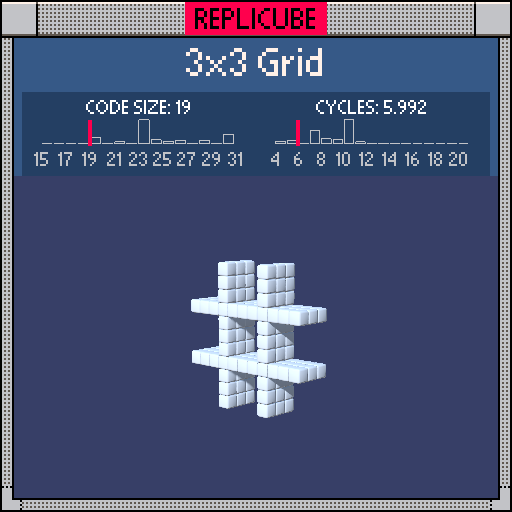

# 3x3 Grid

> A tic-tac-toe board floating in space! Thin grid lines, pure WHITE (ᵔ◡ᵔ)



| Grid | Code Size | Leaderboard | Cycles | Leaderboard | Date |
|:----:|:---------:|:-----------:|:------:|:-----------:|:----:|
| 11x11x11 | **19** | #21 | **5.992** | #967 | 2026-02-23 |

## Solution

```lua
return z*z<4 and(x*x==4 or y*y==4)
```

## How it works

`z*z<4` keeps only the thin slab where z is -1, 0, or 1. Within that slab, `x*x==4` catches the vertical lines at x=±2 and `y*y==4` catches the horizontal lines at y=±2. Squaring lets us check both sides with one comparison! And since the target color is WHITE (1), we let `and` return `true` directly instead of `and 1` ✧
