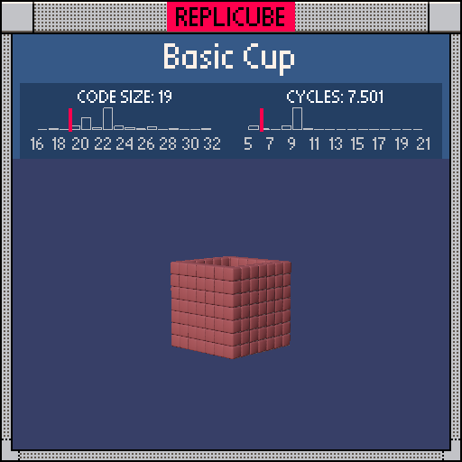

# Basic Cup

> A brown cup carved out of a solid cube! ☕ (っ˘ω˘ς)



| Grid | Code Size | Leaderboard | Cycles | Leaderboard | Date |
|:----:|:---------:|:-----------:|:------:|:-----------:|:----:|
| 7x7x7 | **19** | #370 | **7.501** | #460 | 2026-02-23 |

## Solution

```lua
return(x*x>4 or z*z>4 or y<-2)and 15
```

## How it works

Instead of filling everything then carving a hole, we just check if we're on the cup's shell:

| Check | What it means |
|:------|:-------------|
| `x*x>4` | On the left/right wall (`x=±3`) |
| `z*z>4` | On the front/back wall (`z=±3`) |
| `y<-2` | On the bottom floor (`y=-3`) |

Any of those true? BROWN. Otherwise, empty. That's a cup!
