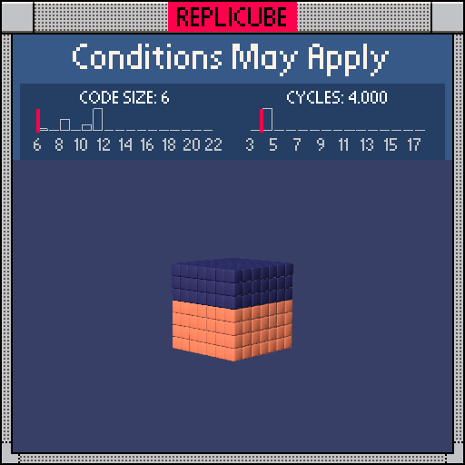

# Conditions May Apply

> Top half DARKBLUE, bottom half ORANGE, solved with pure bit math! (¬‿¬)



| Grid | Code Size | Cycles |
|:----:|:---------:|:------:|
| 7x7x7 | **6** | **4.000** |

## Solution

```lua
return y+11&-4
```

## How it works

`y+11` shifts our coordinate range from {-3..3} to {8..14}. Then bitwise AND with `-4` (which is `...11111100` in binary) rounds everything down to the nearest multiple of 4.

| y | y+11 | &-4 | Color |
|:-:|:----:|:---:|:-----:|
| -3 .. 0 | 8 .. 11 | **8** | ORANGE |
| 1 .. 3 | 12 .. 14 | **12** | DARKBLUE |

Pure bit math, no branching needed! ᕦ(ò_óˇ)ᕤ
