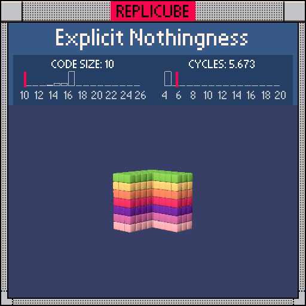

# Explicit Nothingness

> Carve out a quadrant of emptiness, let the rainbow fill the rest! ᕙ(⇀‸↼‶)ᕗ

> [!TIP]
> **#1** on the code size leaderboard!



| Grid | Code Size | Leaderboard | Cycles | Leaderboard | Date |
|:----:|:---------:|:-----------:|:------:|:-----------:|:----:|
| 7x7x7 | **10** | 🏆 #1 | **5.673** | #8615 | 2026-02-23 |

## Solution

```lua
return x|z<0 and y+7
```

## How it works

`x|z` (bitwise OR) is negative whenever at least one of x, z is negative, because the sign bit propagates through OR. So `x|z<0` is a compact way to check "are we outside the x>=0, z>=0 quadrant?"

When true, we return `y+7` which maps each y-level to a different color:

| y | y+7 | Color |
|:-:|:---:|:-----:|
| -3 | 4 | PEACH |
| -2 | 5 | PINK |
| -1 | 6 | PURPLE |
| 0 | 7 | RED |
| 1 | 8 | ORANGE |
| 2 | 9 | YELLOW |
| 3 | 10 | LIGHTGREEN |

When both x and z are non-negative, the `and` short-circuits to `false` which means empty. Bitwise ops doing the heavy lifting again ✧
