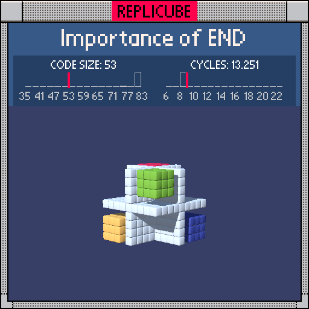

# Importance of END

> White cross with four colored corners, each a different sign combo (ノ´ヮ`)ノ*: ・゚✧



| Grid | Code Size | Leaderboard | Cycles | Leaderboard | Date |
|:----:|:---------:|:-----------:|:------:|:-----------:|:----:|
| 9x9x9 | **53** | #35 | **13.251** | #547 | 2026-02-23 |

## Solution

```lua
a=x*y*z
return a==0 or min(x*x,y*y,z*z)>1 and a>0 and(x>0 and(y>0 and 10 or 13)or y>0 and 7 or 9)
```

## How it works

Three layers of logic packed into one expression:

| Check | What it does |
|:------|:-------------|
| `a==0` | Any axis is zero? White cross! (`true` = WHITE in Replicube) |
| `min(x*x,y*y,z*z)>1` | All coordinates have abs > 1? We're in a corner |
| `a>0` | Product is positive? Only 4 of 8 octants get filled |

The color depends purely on the signs of x and y. Nested `and/or` picks LIGHTGREEN, BLUE, RED, or YELLOW for each octant (╯°□°)╯
