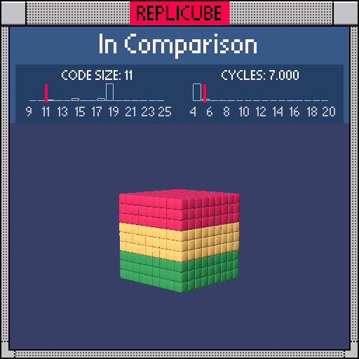

# In Comparison

> Three horizontal color bands from a single line of integer division! ᕙ(⇀‸↼‶)ᕗ



| Grid | Code Size | Leaderboard | Cycles | Leaderboard | Date |
|:----:|:---------:|:-----------:|:------:|:-----------:|:----:|
| 9x9x9 | **11** | #200 | **7.000** | #7812 | 2025-02-23 |

## Solution

```lua
return 9-(y+1)//3*2
```

## How it works

`(y+1)//3` splits the y axis into three equal bands using integer division. Then we multiply by 2 and subtract from 9 to map each band to its color.

| y | (y+1)//3 | *-2+9 | Color |
|:-:|:--------:|:-----:|:-----:|
| -4 .. -2 | -1 | **11** | GREEN |
| -1 .. 1 | 0 | **9** | YELLOW |
| 2 .. 4 | 1 | **7** | RED |

The +1 offset before dividing ensures the bands split cleanly at y=-2 and y=2 ✧
