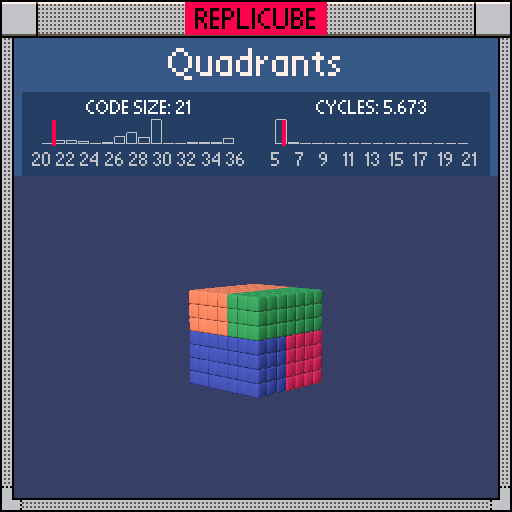

# Quadrants

> Four colored zones split by y, then x or z ┐(´～`)┌



| Grid | Code Size | Leaderboard | Cycles | Leaderboard | Date |
|:----:|:---------:|:-----------:|:------:|:-----------:|:----:|
| 7x7x7 | **21** | #28 | **5.673** | #10665 | 2026-02-23 |

## Solution

```lua
return y>0 and(x>0 and 11 or 8)or z>0 and 13 or 7
```

## How it works

One nested `and/or` chain does it all:

| y | secondary | Color |
|:-:|:---------:|:-----:|
| y > 0 | x > 0 | LIGHTGREEN (11) |
| y > 0 | x <= 0 | ORANGE (8) |
| y <= 0 | z > 0 | BLUE (13) |
| y <= 0 | z <= 0 | RED (7) |

Top half splits on x, bottom half splits on z. Just 1 token away from #1... we'll be back for it (⌐■_■)
