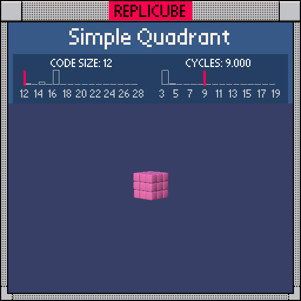

# Simple Quadrant

> Fill one octant with PINK using nothing but arithmetic, no comparisons allowed! (¬‿¬)

> [!TIP]
> **#1** on the code size leaderboard!



| Grid | Code Size | Leaderboard | Cycles | Leaderboard | Date |
|:----:|:---------:|:-----------:|:------:|:-----------:|:----:|
| 7x7x7 | **12** | 🏆 #1 | **9.000** | #11358 | 2026-02-23 |

## Solution

```lua
return min(x,y,z)//-4*-5
```

## How it works

`min(x,y,z)` is positive only when all three coordinates are positive. Floor-dividing by `-4` maps positive values (1..3) to `-1` and everything else (0..-3) to `0`. Then multiplying by `-5` turns `-1` into `5` (PINK) and keeps `0` as empty.

| min(x,y,z) | //-4 | *-5 | Result |
|:----------:|:----:|:---:|:------:|
| 1 .. 3 | -1 | **5** | PINK |
| -3 .. 0 | 0 | **0** | EMPTY |

Both unary minuses are free (they follow operators), so `-4` and `-5` each cost just 1 token ✧
