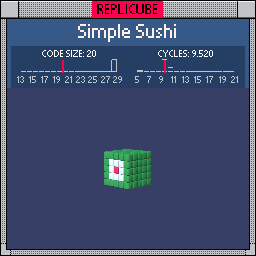

# Simple Sushi

> A tiny sushi roll! Green seaweed wrap, white rice, red fish center (っ˘ڡ˘ς)



| Grid | Code Size | Leaderboard | Cycles | Leaderboard | Date |
|:----:|:---------:|:-----------:|:------:|:-----------:|:----:|
| 5x5x5 | **20** | #541 | **9.520** | #1948 | 2026-02-23 |

## Solution

```lua
return x|y==0 and 7 or x*x+y*y<4 or 11
```

## How it works

One-liner, three zones:

| Check | Result | Color |
|:------|:-------|:------|
| `x\|y==0` | Both x and y are zero | RED (fish!) |
| `x*x+y*y<4` | Returns `true` = WHITE | Rice ring |
| Otherwise | `11` | GREEN (seaweed wrap) |

The `true` = WHITE trick saves us from writing `or 1` at the end! Z is completely ignored since every layer is identical.
