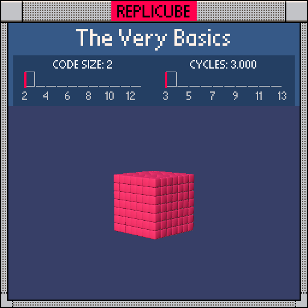

# The Very Basics

> Fill the entire cube with a single color. Welcome to Replicube! ꒰ᐢ⸝⸝•༝•⸝⸝ᐢ꒱



| Grid | Code Size | Cycles |
|:----:|:---------:|:------:|
| 7x7x7 | **2** | **3.000** |

## Solution

```lua
return ORANGE
```

That's it. That's the whole thing. Every voxel returns ORANGE, done ✧
