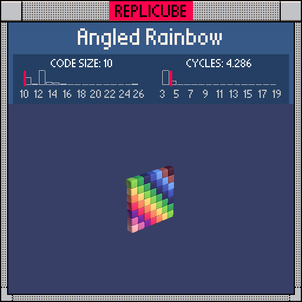

# Angled Rainbow

> Colors are just numbers, and numbers are just vibes ✧⁺(◕ᴗ◕✿)

> [!TIP]
> **#1** on the code size leaderboard!



| Grid | Code Size | Leaderboard | Cycles | Leaderboard | Date |
|:----:|:---------:|:-----------:|:------:|:-----------:|:----:|
| 7x7x7 | **10** | 🏆 #1 | **4.286** | #8941 | 2026-02-23 |

## Solution

```lua
return z==0 and x+y+10
```

## How it works

A flat wall at `z==0` where each voxel's color is `x+y+10`. The coordinates range from -3 to 3, so `x+y` ranges from -6 to 6, offset by 10 gives colors 4 through 16. Wrapping handles the rest. The `and` short-circuit replaces `if/then/end` for free.
