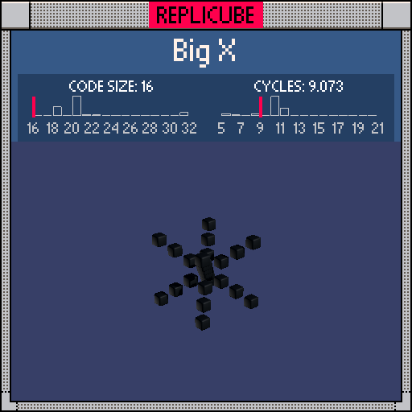

# Big X

> Four space diagonals, one cube, zero wasted tokens ᕦ(ò_óˇ)ᕤ

> [!TIP]
> **#1** on the code size leaderboard!



| Grid | Code Size | Leaderboard | Cycles | Leaderboard | Date |
|:----:|:---------:|:-----------:|:------:|:-----------:|:----:|
| 7x7x7 | **16** | 🏆 #1 | **9.073** | #1513 | 2026-02-23 |

## Solution

```lua
return x*x*2==y*y+z*z and 3
```

## How it works

The shape is every voxel where `|x|=|y|=|z|`, the four space diagonals of the cube. The standard approach checks `abs(x)==abs(y) and abs(y)==abs(z)`, but that's expensive.

Instead we use a number theory shortcut: `2x² = y² + z²` only has integer solutions where all three absolute values are equal (within this grid's range of 0-3). This collapses two comparisons into one equation, saving tokens. `and 3` returns BLACK when the condition holds, empty otherwise.
