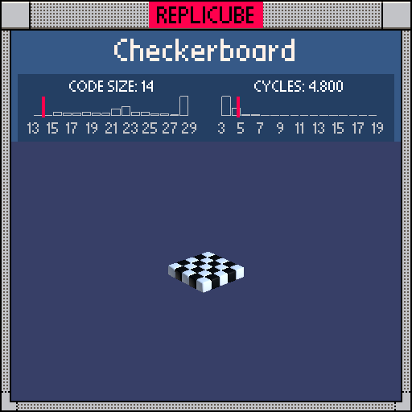

# Checkerboard

> A flat checkerboard that never heard of modulo ꒰ᐢ˶ • ༝ •˶ᐢ꒱



| Grid | Code Size | Leaderboard | Cycles | Leaderboard | Date |
|:----:|:---------:|:-----------:|:------:|:-----------:|:----:|
| 5x5x5 | **14** | #36 | **4.800** | #7085 | 2026-02-23 |

## Solution

```lua
return y==0 and x+z<<1&2|1
```

## How it works

Flat plane at `y==0`, alternating WHITE(1) and BLACK(3) based on parity of `x+z`. The color expression `x+z<<1&2|1` is the fun part: shift `x+z` left by 1 to move the parity bit into position, mask with `&2` to isolate it (gives 0 or 2), then `|1` to set the low bit (gives 1 or 3). No modulo, no parens around `(x+z)` since `+` naturally binds tighter than `<<`.
