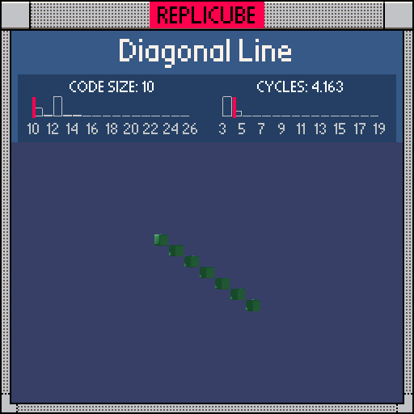

# Diagonal Line

> A single green line cutting through the cube corner to corner ⸜(｡˃ ᵕ ˂ )⸝♡

> [!TIP]
> **#1** on the code size leaderboard!



| Grid | Code Size | Leaderboard | Cycles | Leaderboard | Date |
|:----:|:---------:|:-----------:|:------:|:-----------:|:----:|
| 7x7x7 | **10** | 🏆 #1 | **4.163** | #8158 | 2026-02-23 |

## Solution

```lua
return x==y and y==z and 11
```

## How it works

The diagonal line is every voxel where all three coordinates are equal. Chain two equality checks with `and`, then `and 11` for GREEN. When either check fails, the whole chain short-circuits to `false` (empty). Clean!
