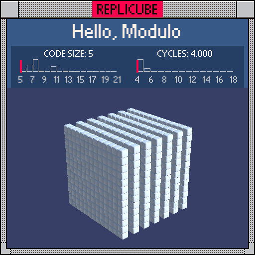

# Hello, Modulo

> Who needs modulo when you have bitwise NOT? (⌐■_■)

> [!TIP]
> **#1** on both code size AND cycles leaderboards!



| Grid | Code Size | Leaderboard | Cycles | Leaderboard | Date |
|:----:|:---------:|:-----------:|:------:|:-----------:|:----:|
| 13x13x13 | **5** | 🏆 #1 | **4.000** | 🏆 #1 | 2026-02-23 |

## Solution

```lua
return~x&1
```

## How it works

The puzzle wants vertical slabs at every even x. The textbook approach is `x%2==0` (6 tokens), but bitwise is cheaper. `~x` flips every bit, then `&1` isolates the last one. Even numbers have bit 0 = 0, which flips to 1 (WHITE). Odd numbers have bit 0 = 1, which flips to 0 (empty). Five tokens, four cycles, nowhere left to go.
