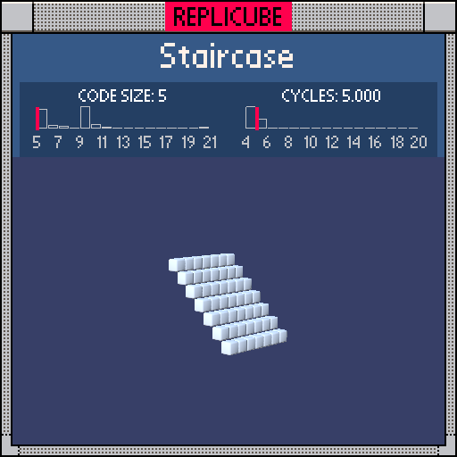

# Staircase

> A diagonal staircase in just 5 tokens! Can't get simpler than this (⌐■_■)

> [!TIP]
> **#1** on the code size leaderboard!



| Grid | Code Size | Leaderboard | Cycles | Leaderboard | Date |
|:----:|:---------:|:-----------:|:------:|:-----------:|:----:|
| 7x7x7 | **5** | 🏆 #1 | **5.000** | #7548 | 2026-02-23 |

## Solution

```lua
return x==-y
```

## How it works

The staircase lives where `x == -y`. Returning `true` gives us WHITE (1) for free, and `false` gives empty. That's it. Five tokens. Done.
