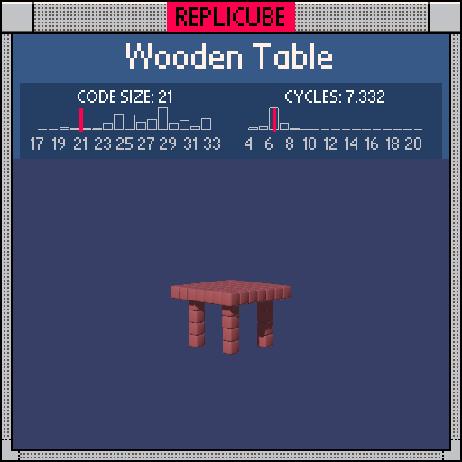

# Wooden Table

> Four legs and a flat top, held together by number theory (∩˃o˂∩)



| Grid | Code Size | Leaderboard | Cycles | Leaderboard | Date |
|:----:|:---------:|:-----------:|:------:|:-----------:|:----:|
| 7x7x7 | **21** | #339 | **6.464** | #976 | 2026-02-23 |

## Solution

```lua
return(y==1 or y<1 and x*x+z*z==8)and 15
```

## How it works

The tabletop is a full layer at `y==1`. The four legs are columns at the corners (`|x|=2, |z|=2`) running from `y=0` down to `y=-3`. Instead of checking `abs(x)==2 and abs(z)==2` separately (expensive!), we use `x*x+z*z==8` which is only satisfied by `|x|=|z|=2` within this grid. One equation replaces two comparisons.
