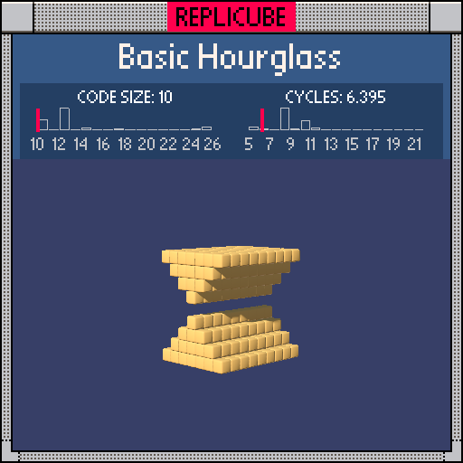

# Basic Hourglass

> Who needs abs() when you have multiplication? (⌐■_■)

> [!TIP]
> **#1** on the code size leaderboard!



| Grid | Code Size | Leaderboard | Cycles | Leaderboard | Date |
|:----:|:---------:|:-----------:|:------:|:-----------:|:----:|
| 9x9x9 | **10** | 🏆 #1 | **6.395** | #911 | 2026-02-23 |

## Solution

```lua
return x*x<y*y and 9
```

## How it works

The hourglass is every voxel where `|x| < |y|`. Instead of `abs(x) < abs(y)` (4 tokens for two abs calls), we compare squares: `x*x < y*y`. Squaring preserves the magnitude relationship while ditching the function calls. `and 9` returns YELLOW when true, empty when false.
