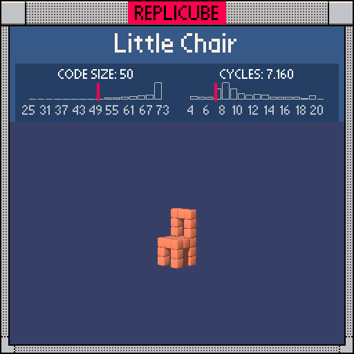

# Little Chair

> Sit down, this one's all ORANGE (⌐■_■)



| Grid | Code Size | Leaderboard | Cycles | Leaderboard | Date |
|:----:|:---------:|:-----------:|:------:|:-----------:|:----:|
| 7x7x7 | **50** | #263 | **7.160** | #565 | 2026-02-23 |

## Solution

```lua
return x*x<2 and(y==-1 and z*z<2 or y==2 and z==-1 or x~=0 and(y<-1 and z*z==1 or z==-1 and y<2))and 8
```

## How it works

The chair has four parts: a 3x3 seat, four legs, two back uprights, and a top bar. All ORANGE.

The outer `x*x<2` gate locks everything to |x|<=1 (the chair's width), then a nested `or`-chain handles each part. The `x~=0` inner gate separates the legs and uprights (which only exist at x=±1) from the seat and top bar (which include x=0).
