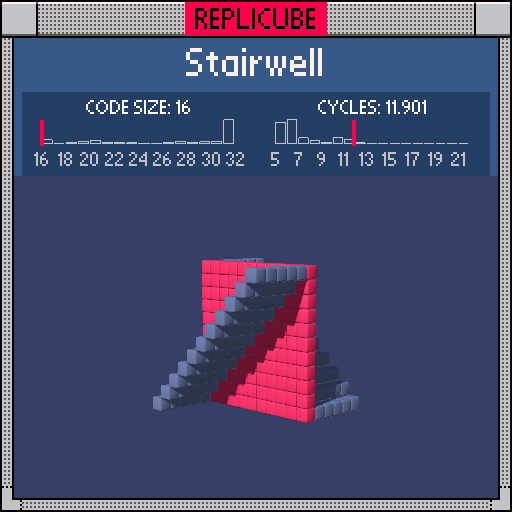

# Stairwell

> Two diagonal walls and a flat floor walk into a bar ꒰ᐢ⸝⸝•༝•⸝⸝ᐢ꒱

> [!TIP]
> #1 on the code size leaderboard!



| Grid | Code Size | Leaderboard | Cycles | Leaderboard | Date |
|:----:|:---------:|:-----------:|:------:|:-----------:|:----:|
| 11x11x11 | **16** | 🏆 #1 | **11.901** | #8429 | 2026-02-23 |

## Solution

```lua
return z==0 and 7 or x*sign(z)==y and 2
```

## How it works

A fire-escape stairwell with symmetry: a full RED floor at z=0, and two GREY diagonal walls spiraling in opposite directions.

Handle `z==0` first for the floor (RED), then use `sign(z)` to flip the diagonal direction for the walls. When z>0, `x*1==y` gives one wall; when z<0, `x*(-1)==y` gives the mirrored wall. The whole thing collapses into one chained `and/or` expression!
