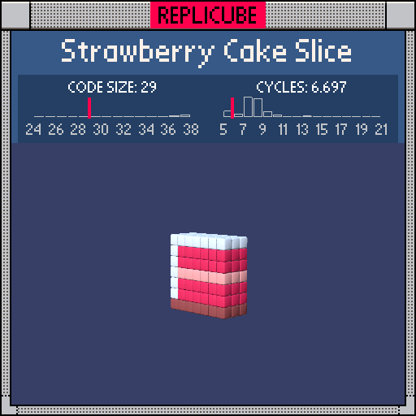

# Strawberry Cake Slice

> Five colors, zero if-statements, one delicious expression ꒰ᐢ˶ˆ꒳ˆ˶ᐢ꒱



| Grid | Code Size | Leaderboard | Cycles | Leaderboard | Date |
|:----:|:---------:|:-----------:|:------:|:-----------:|:----:|
| 7x7x7 | **29** | #4 | **6.802** | #943 | 2026-02-23 |

## Solution

```lua
return z*z<2 and(y==-3 and 15 or x==-3 or y>2 or y==0 and 4 or 7)
```

## How it works

One chained `and/or` ternary does all the work. `z*z<2` gates the 3-deep slab. Then the chain picks the right color: BROWN(15) for the bottom crust at `y==-3`, WHITE(1) for the left edge (`x==-3`) and top (`y>2`) by returning bare `true` (which the game treats as color 1), PEACH(4) for the cream layer at `y==0`, and RED(7) as the default cake body. No `if/then/end` blocks means no wasted keywords.
