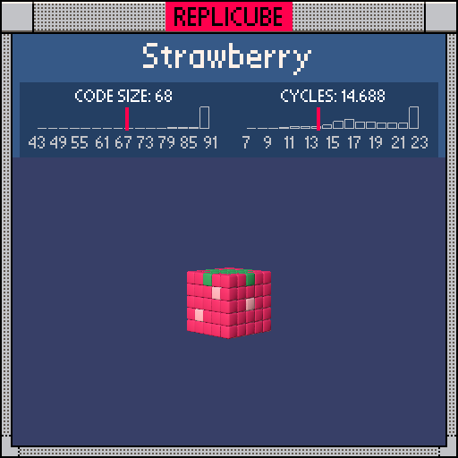

# Strawberry

> Every single voxel is filled. It's all about the colors (ꈍᴗꈍ)🍓



| Grid | Code Size | Leaderboard | Cycles | Leaderboard | Date |
|:----:|:---------:|:-----------:|:------:|:-----------:|:----:|
| 5x5x5 | **68** | #166 | **14.688** | #768 | 2026-02-23 |

## Solution

```lua
return y==2 and x*x+z*z<5 and 11
or(x*x+y*y+z*z<4 or x*y==1
or(y|z)==0 or x==0 and y==-2 and z==-1
or x==1 and z==1)and 4 or 7
```

## How it works

All 125 voxels are filled. Three colors: GREEN(11) leaves on top, RED(7) skin on the shell, and PEACH(4) for the interior + seeds.

The trick is grouping all PEACH conditions into one `or`-chain under a single `and 4`:
- `x*x+y*y+z*z<4` captures the inner 3x3x3 cube (sum of squares separates inner from shell perfectly)
- The remaining `or` clauses pick out individual seed positions on the shell
- `x*y==1` replaces `x==y and abs(x)==1` using the product-equals-one trick (4 tokens saved!)
- `(y|z)==0` replaces `y==0 and z==0` using bitwise OR (1 token saved!)

Everything that isn't a leaf or PEACH falls through to `or 7` (RED skin).
