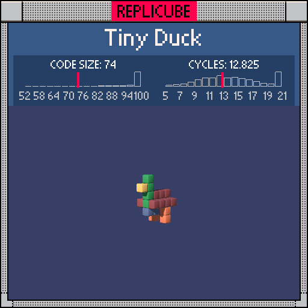

# Tiny Duck

> 27 voxels of pure quack energy (⌐■_■)🦆



| Grid | Code Size | Leaderboard | Cycles | Leaderboard | Date |
|:----:|:---------:|:-----------:|:------:|:-----------:|:----:|
| 7x7x7 | **74** | #70 | **12.825** | #3208 | 2026-02-23 |

## Solution

```lua
return x*x==1 and z==-1 and y>-3 and y<0 and 8
or x==0 and((y==2 and z==2)and 9 or(z==1 and y>-1)and 11)
or x*x+abs(y)<2 and z>-3 and z<2 and(y<0 and 2 or 15)
```

## How it works

One big chained ternary, no variables, no `if` blocks. The duck has four parts:
- **Legs** (ORANGE): `x*x==1` at the corners, `z=-1`, below the body
- **Beak + neck** (YELLOW/GREEN): gated by `x==0`, beak at (0,2,2) returns 9, neck at z=1 returns 11
- **Body** (GREY/BROWN): diamond shape via `x*x+abs(y)<2`, flat slab in z, grey belly (`y<0`) and brown top

The beak and neck share an `x==0` gate with a nested ternary inside, saving tokens over separate conditions.
