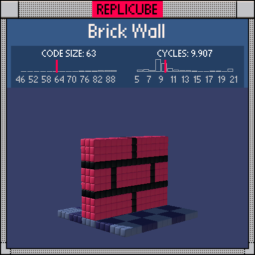

# Brick Wall

> Mortar is just the absence of brick if you think about it hard enough ᕙ(⇀‸↼‶)ᕗ



| Grid | Code Size | Leaderboard | Cycles | Leaderboard | Date |
|:----:|:---------:|:-----------:|:------:|:-----------:|:----:|
| 15x15x15 | **63** | #56 | **9.907** | #2082 | 2026-02-23 |

## Solution

```lua
v=y-1 return y==-7 and 2+(((x+1)//3+(z+1)//3)%2)*10 or z*z<4 and y<5 and(v%4*((x+(v&-4))%8)==0 and 3 or 7)
```

## How it works

Two parts: a tiled floor and a brick wall.

**The floor** (`y==-7`) divides coordinates into 3x3 tile blocks using integer division `//3`, then colors them grey or darkblue based on whether the tile sum is even or odd. Classic checkerboard, just at a bigger scale.

**The wall** (`z*z<4 and y<5`) is where the fun is. Bricks are 8 wide and 4 tall, with every other row offset by 4 (the classic staggered pattern). We get that offset with `v&-4`, which rounds `y-1` down to the nearest multiple of 4 using our favorite bit-mask trick. Add that to `x`, mod by 8, and you've got the vertical mortar lines.

The sneaky bit: instead of checking `horizontal_mortar or vertical_mortar` with an `or` keyword, we multiply them together. A product is zero when either factor is zero, so `v%4 * bx%8 == 0` catches both mortar directions in one shot. Saved us 2 tokens over the `or` version!
