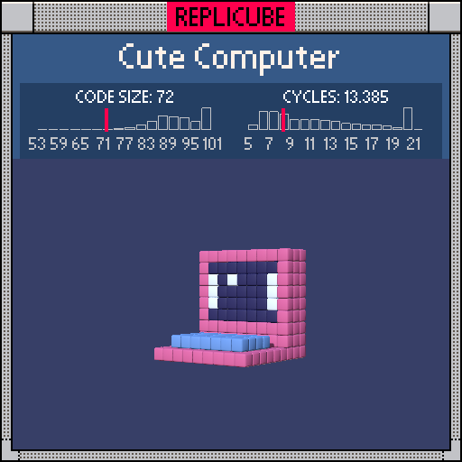

# Cute Computer

> Three parts, one `return`, zero regrets ꒰ᐢ⸝⸝•༝•⸝⸝ᐢ꒱



| Grid | Code Size | Leaderboard | Cycles | Leaderboard | Date |
|:----:|:---------:|:-----------:|:------:|:-----------:|:----:|
| 9x9x9 | **72** | #41 | **1.126** | #1126 | 2026-02-23 |

## Solution

```lua
v=y-1 p=x*x return p<16 and(z==-2 and v*v<9 and((p==9 and v*v<4 or x==-1 and y==2)and 1 or 12)or y==-3 and z>>2==0 and 14)or(y<-3 or z<-1)and 5
```

## How it works

It's a tiny computer! Pink shell, dark blue screen with a white border, a little power light, and a light blue keyboard tray.

The trick is breaking it into three layers and handling them in priority order. The screen and keyboard share the same x-range (`abs(x)<4`), so we gate on `x*x<16` once and branch inside: `z==-2` hits the screen face, `y==-3` hits the keyboard shelf.

The screen's white border is where `abs(x)==3` (left/right edges) and the center rows, plus a single power LED at `x==-1, y==2`. Everything else on the screen is dark blue. We store `v=y-1` so the screen's vertical center is at 0, and `v*v<9` / `v*v<4` handle the height checks without calling `abs` twice.

The keyboard uses a neat trick: `z>>2==0` checks that z is in [0,3] in just 4 tokens. Right-shifting by 2 gives 0 only for values 0-3 (for non-negatives in our range), replacing a clunkier range check.

Everything that isn't screen or keyboard but sits on the shell surface (`y<-3` for the bottom, `z<-1` for the back) gets painted pink.
