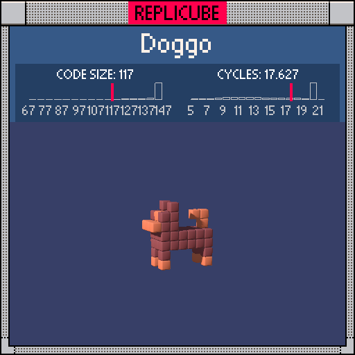

# Doggo

> Probably the cutest 64 voxels you'll ever see ꒰ᐢ⸝⸝•༝•⸝⸝ᐢ꒱🐕



| Grid | Code Size | Leaderboard | Cycles | Leaderboard | Date |
|:----:|:---------:|:-----------:|:------:|:-----------:|:----:|
| 7x7x7 | **117** | #203 | **17.627** | #2210 | 2026-02-23 |

## Solution

```lua
a=abs(x)return a<2 and(y<1 and y>-2 and z<3 and 15
or z>0 and z<4 and y>0 and y<4 and y+z<5 and(y~=3 or x~=0)
and(a<z-1 and 8 or 15))
or a==1 and(z==2 or z==-3)and y<-1 and(y<-2 and 8 or 15)
or max(y+1,-z)==3 and y>0 and x==0 and z<-1 and 8
```

## How it works

Four parts, two colors (BROWN and ORANGE), tons of x-axis symmetry via `a=abs(x)`.

- **Body**: `a<2` slab at y={-1,0}, z<3. All BROWN.
- **Head**: Same `a<2` gate, triangular shape cut by `y+z<5`. The nose/face (`a<z-1`) is ORANGE, rest BROWN. Eye at (0,3,1) punched out with `y~=3 or x~=0`.
- **Legs**: `a==1` at z=2 (front) and z=-3 (back). ORANGE paws at the bottom, BROWN above.
- **Tail**: Diagonal curve via `max(y+1,-z)==3`. All ORANGE.
