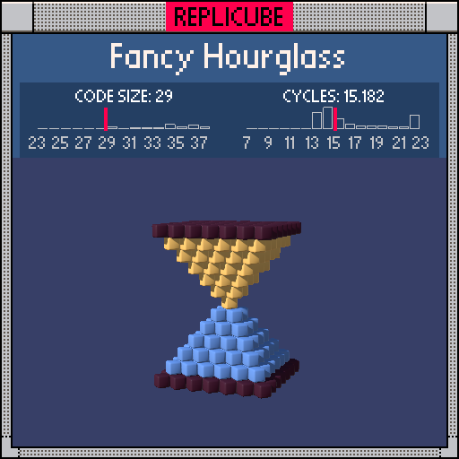

# Fancy Hourglass

> An octahedron with a paint job walks into a bar... (◕‿◕✿)



| Grid | Code Size | Leaderboard | Cycles | Leaderboard | Date |
|:----:|:---------:|:-----------:|:------:|:-----------:|:----:|
| 13x13x13 | **29** | #24 | **15.182** | #1597 | 2025-02-23 |

## Solution

```lua
return abs(y)>=abs(x)+abs(z)and(abs(y)>5 and 16 or y<0 and 14 or 9)
```

## How it works

The shape is an octahedron (diamond) aligned to the Y axis: `abs(y) >= abs(x) + abs(z)`. That's the L1 norm condition that makes those nice pointy tips.

Three colors: darkbrown caps at the very top and bottom (`abs(y) > 5`, which only fires at the extent boundary), yellow for the upper half, and lightblue for the lower half. All packed into one chained `and/or` ternary.
