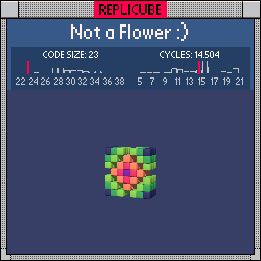

# Not a Flower :)

> A diamond with a hole in it. Turns out if you punch a ring out of a diamond, you get something that's definitely not a flower (╥﹏╥)

> [!TIP]
> **#3** on the code size leaderboard!



| Grid | Code Size | Leaderboard | Cycles | Leaderboard | Date |
|:----:|:---------:|:-----------:|:------:|:-----------:|:----:|
| 7x7x7 | **23** | 🥉 #3 | **14.504** | #2287 | 2026-02-23 |

## Solution

```lua
a=abs(x)+abs(y) return z*z<2 and a~=3 and a+6
```

## How it works

The whole thing lives in a 3-layer slab (`z*z<2` keeps only z = -1, 0, 1). Inside that slab, we're looking at `abs(x)+abs(y)`, the Manhattan distance from the Y axis. That distance plus 6 becomes the color directly, giving us concentric diamond rings that shift through the palette as they expand outward.

The fun part is the hole! When `abs(x)+abs(y)` is exactly 3, we get `a~=3` returning false, which kills the whole `and` chain and leaves those voxels empty. That missing ring is what turns a solid diamond into a "not a flower" (︶︹︶)

Storing `abs(x)+abs(y)` in `a` saves us from computing it twice, shaving 4 tokens off the no-temp version.
