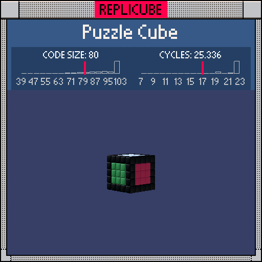

# Puzzle Cube

> Six faces, six colors, one very confused `return` statement (°ロ°)



| Grid | Code Size | Leaderboard | Cycles | Leaderboard | Date |
|:----:|:---------:|:-----------:|:------:|:-----------:|:----:|
| 5x5x5 | **80** | #653 | **25.336** | #581 | 2026-02-23 |

## Solution

```lua
p=x*x q=y*y r=z*z return p|r<4 and(y==2 or y==-2 and 9)or q|r<4 and(x==-2 and 14 or x==2 and 11)or p|q<4 and(z==-2 and 7 or z==2 and 8)or p|q|r>3 and 3
```

## How it works

It's a Rubik's cube! Black frame with a different color on each face: white on top, yellow on bottom, lightblue/green on the sides, red/orange front and back.

We store `x*x`, `y*y`, `z*z` in `p`, `q`, `r` and then lean hard on bitwise OR to check if coordinates are "small" (within the face center). `p|r<4` means both `abs(x)` and `abs(z)` are less than 2, so we're looking at the top/bottom face strip. If `y` is at the edge (±2), we paint the face color, otherwise the `and/or` chain moves on.

The top face (`y==2`) uses the bare-true-as-WHITE trick: since `true` counts as color 1 in the game, we just let `y==2` return true directly instead of writing `y==2 and 1`. One of our favorite freebies!

The frame itself is anything on the surface (`p|q|r>3`, meaning at least one coordinate is at the edge) that wasn't already claimed by a face. All the leftover surface gets painted black.
