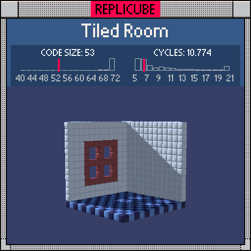

# Tiled Room

> Two walls, a checkerboard floor, and a picture frame. Just needs a tiny couch (⌐■_■)



| Grid | Code Size | Leaderboard | Cycles | Leaderboard | Date |
|:----:|:---------:|:-----------:|:------:|:-----------:|:----:|
| 13x13x13 | **53** | #97 | **10.774** | #1365 | 2026-02-23 |

## Solution

```lua
p=x*x|y*y return y==-6 and x+z<<1&2|12 or(z==6 or x==-6)and(p<9 and x*y~=0 and 0 or p<16 and 15 or 1)
```

## How it works

Three surfaces crammed into one return statement!

**The floor** (`y==-6`) uses a fun bit trick: `x+z<<1&2|12` shifts the parity bit of `x+z` into position, masks it, then ORs with 12. The result alternates between 12 (darkblue) and 14 (lightblue) without a single `and/or` branch.

**The walls** (`z==6` back wall, `x==-6` left wall) have a brown picture frame with empty windows. We stash `x*x|y*y` in `p` so we can cheaply check whether we're inside different distance thresholds. `p<9` catches the inner region (where `abs(x)<3` and `abs(y)<3`), `p<16` catches the frame border. The `x*y~=0` check carves out the holes by keeping only voxels where neither coordinate is zero, returning 0 (empty) for those.

The `x*x|y*y` trick is the star here. Bitwise OR of two squares acts like a "both coordinates in range" check: if either square is too big, the OR result blows past the threshold. Way cheaper than two separate `abs()` comparisons!
