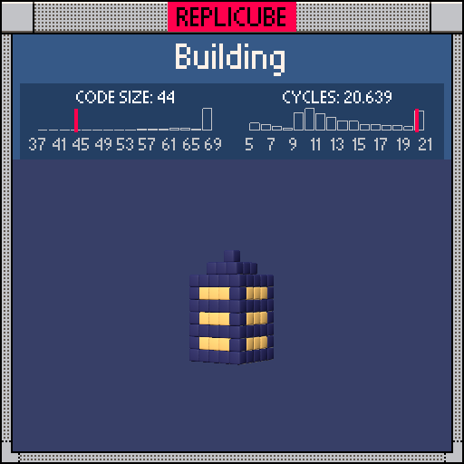

# Building

> A cute little skyscraper with glowing windows (｡◕‿◕｡)



| Grid | Code Size | Leaderboard | Cycles | Leaderboard | Date |
|:----:|:---------:|:-----------:|:------:|:-----------:|:----:|
| 9x9x9 | **44** | #41 | **20.639** | #2571 | 2026-02-23 |

## Solution

```lua
f=min(4-y,2)return max(abs(x),abs(z))<=f and(y<2 and y&1~=0 and abs(x)~=abs(z)and 9 or 12)
```

## How it works

It's a stepped tower! The building gets narrower as you go up, like a real skyscraper with setbacks. `min(4-y, 2)` computes the half-width at each floor: 2 blocks wide for the lower floors, then shrinking as y climbs past 2. `max(abs(x), abs(z))` checks if you're inside that square footprint.

The fun part is the windows. On odd floors (`y&1~=0`) below the roof (`y<2`), any voxel that's NOT on a corner diagonal (`abs(x)~=abs(z)`) lights up yellow. The corners stay dark blue, giving that classic building look where edges are structural and the faces between them glow. Everything else is dark blue shell.
