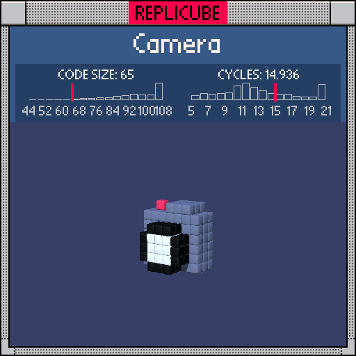

# Camera

> Say cheese! This tiny camera even has a lens and a flash (⌐■_■)



| Grid | Code Size | Leaderboard | Cycles | Leaderboard | Date |
|:----:|:---------:|:-----------:|:------:|:-----------:|:----:|
| 7x7x7 | **65** | #74 | **14.936** | #1736 | 2026-02-23 |

## Solution

```lua
d=x*x+(y+1)*(y+1)
return z>1 and(d<3 or d<6 and 3)or x==-2 and y==3 and z==0 and 7 or z*z<4 and(y<3 or abs(x-1)<2)and 2
```

## How it works

Three parts stacked in an `or` chain, checked front to back.

The **lens** sticks out the front (z>1). It's two concentric circles centered at (0,-1) using squared distance `d`: the inner ring (`d<3`) returns bare `true` which the game reads as WHITE, and the outer ring (`d<6`) is BLACK. Squaring the radius thresholds (1.5²≈3, 2.4²≈6) lets us skip `sqrt` entirely.

The **flash** is a single red voxel at (-2, 3, 0), just a simple coordinate check.

The **body** is the grey box. It's two slabs joined together: a tall slab (`y<3`, full width) and a shorter grip piece (`abs(x-1)<2`, extending up to y=3). The `y<3` trick works because on this 7x7x7 grid, `abs(y+1)<4` from the reference only excludes y=3, so `y<3` does the same job for 2 fewer tokens.
