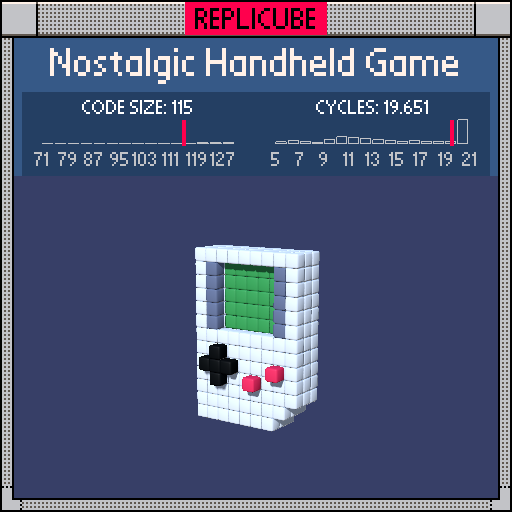

# Nostalgic Handheld Game

> It's dangerous to golf alone, take this! ꒰˘̩̩̩⌣˘̩̩̩꒱♡



| Grid | Code Size | Leaderboard | Cycles | Leaderboard | Date |
|:----:|:---------:|:-----------:|:------:|:-----------:|:----:|
| 13x13x13 | **115** | #313 | **19.651** | #3052 | 2026-02-23 |

## Solution

```lua
a=abs(x)b=abs(y-3)
return z==2 and(abs(x+2)+abs(y+2)<2 and 3 or(x==3 and y==-2 or x==1 and y==-3)and 7)or a<3 and b<3 and(z==0 and 11 or z==1 and 0)or z==1 and a<4 and b<3 and 2 or z*z<4 and a<5 and(x<4 or y>-5)and(y>-6 or x<3)
```

## How it works

A tiny Game Boy, built layer by layer from front to back!

The **front face** (z=2) has all the interactive bits. The d-pad is a cross shape centered at (-2,-2), and Manhattan distance does the heavy lifting: `abs(x+2)+abs(y+2)<2` carves out the plus shape in one shot. The A and B buttons are two lone red voxels.

The **screen** lives at z=0 in green, with a grey frame around it at z=1. The tricky part is the screen *hole*: at z=1 inside the screen area, there should be nothing (you're looking through to the green screen behind). We handle this with `z==1 and 0`, which returns a falsy value that blocks the body from filling in that spot.

The **body** is the white shell, a flat slab at z=-1,0,1 with a notched corner at the bottom-right. Two `or` conditions carve out the notch by excluding voxels where x and y are both too far into that corner.

Everything chains together in priority order: controls first, then screen, then frame, then body. Each layer claims its voxels before the next one gets a chance.
