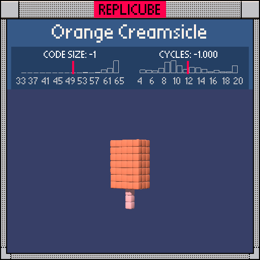

# Orange Creamsicle

> Three layers of frozen goodness, one `return` statement ꒰ᐢ⸝⸝•༝•⸝⸝ᐢ꒱



| Grid | Code Size | Leaderboard | Cycles | Leaderboard | Date |
|:----:|:---------:|:-----------:|:------:|:-----------:|:----:|
| 11x11x11 | **50** | #76 | **2.702** | #2702 | 2026-02-23 |

## Solution

```lua
a=abs(y-1) return z==0 and(x==0 and y<0 and 4 or x*x<4 and a<3)or a<4 and x*x<9 and z*z<4 and 8
```

## How it works

A popsicle! Peach stick at the bottom, white cream filling, orange shell around it.

The key insight is that the popsicle body is vertically centered around y=1 (not y=0), so `abs(y-1)` stored in `a` gives us a nice symmetric measure from the center. All the height checks become simple `a<3` or `a<4` comparisons.

The stick and cream both live on the z==0 plane, so we gate on `z==0` once and handle both inside: stick is the single column at x==0 going downward (`y<0`), cream is the wider slab (`x*x<4`) in the middle rows. Cream returns bare `true` which the game reads as WHITE. Two features, one gate!

The orange shell is everything else within the rounded box (`a<4`, `x*x<9`, `z*z<4`). Since it comes last in the `or` chain, it only paints voxels that weren't already claimed by the stick or cream.
