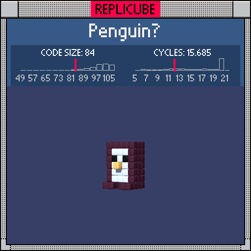

# Penguin

> Not the most accurate penguin, but definitely the most token-efficient one (⌐■_■)



| Grid | Code Size | Leaderboard | Cycles | Leaderboard | Date |
|:----:|:---------:|:-----------:|:------:|:-----------:|:----:|
| 7x7x7 | **84** | #78 | **0.514** | #514 | 2026-02-23 |

## Solution

```lua
a=x*x return(x|y)==0 and z==2 and 9 or a==1 and y==1 and z==1 and 3 or(a<9 and z*z<4 and y>-3 or y==-3 and a>0 and a<5 and z>-2 and z<3)and(a<4 and z>-1 and y*y<9 or 16)
```

## How it works

It's a little penguin! Dark brown body, white belly, two black eyes, and a yellow beak poking out the front.

We handle the special features first: the beak at (0,0,2) using `(x|y)==0` (our bitwise OR zero trick to check two coords are both zero in one shot), then the eyes at (±1,1,1).

After that comes the big shape gate. The body is anything within `abs(x)<3` and `abs(z)<2` above the feet, OR the feet themselves at `y==-3` (just the inner x positions, spread out in z). Both cases funnel into one color decision: if we're in the front half (`z>=0`), close to center (`x*x<4`), and within the torso height (`y*y<9`)... that's the white belly. The bare `true` from the condition *is* WHITE, so we don't even need `and 1`. Everything else in the shape gets dark brown.
