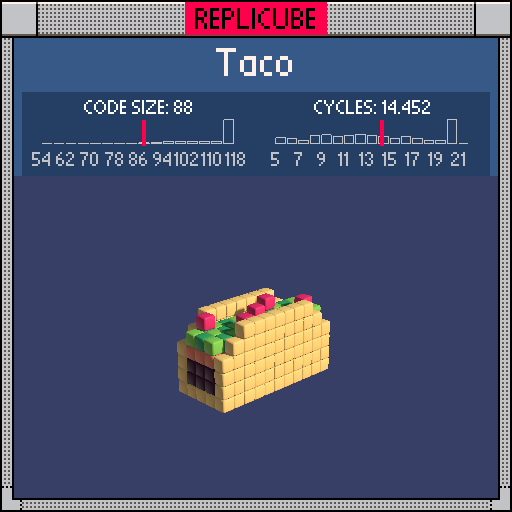

# Taco

> Five fillings, one `return`, zero regrets ꒰ ꒡⌓꒡꒱🌮



| Grid | Code Size | Leaderboard | Cycles | Leaderboard | Date |
|:----:|:---------:|:-----------:|:------:|:-----------:|:----:|
| 11x11x11 | **88** | #138 | **14.452** | #1371 | 2026-02-23 |

## Solution

```lua
a=abs(z)t=y+3
return t>=0 and((a==2 and x*x+t*t<36 or t<1 and a<3)and 9 or a<2 and(t<3 and 16 or t<4 and 8 or t<5 and(x+z)%2+10 or t==5 and(x/2+z)%3==0 and 7))
```

## How it works

The taco is shifted down in the grid, so `t=y+3` recenters everything so the bottom of the shell sits at t=0.

The yellow taco shell has two parts: the curved sides at `z=+-2` (a semicircle using `x*x+t*t<36`) and the flat base at `t=0`. Both get color 9 (YELLOW). These share a single gate so we only write `and 9` once.

Inside the shell (`abs(z)<2`), the fillings stack up layer by layer like a real taco: dark brown meat at the bottom (t=1,2), orange cheese (t=3), alternating green lettuce using `(x+z)%2` for that two-tone look (t=4), and scattered red tomato chunks on top using a modulo pattern (t=5). Each layer is a link in an `and/or` chain, checked in order from bottom to top.
