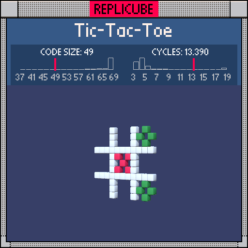

# Tic-Tac-Toe

> X is winning but O has the moral victory of being more token-efficient ꒰ᐢ⸝⸝•༝•⸝⸝ᐢ꒱



| Grid | Code Size | Leaderboard | Cycles | Leaderboard | Date |
|:----:|:---------:|:-----------:|:------:|:-----------:|:----:|
| 11x11x11 | **49** | #21 | **3.068** | #3068 | 2026-02-23 |

## Solution

```lua
a=abs(x) b=abs(y) return z==0 and(a==b and a<2 and 7 or abs(x-4)+abs(b-4)==1 and 11 or a==2 or b==2)
```

## How it works

It's a tic-tac-toe board! Everything lives on the z==0 plane, which is our first gate.

The X marks sit where `abs(x)==abs(y)` (the diagonals) and both are small (`<2`), so just the center cell's X pattern. Those get painted red.

The O mark is a diamond shape centered at (4, ±4). We check it with the classic Manhattan distance trick: `abs(x-4)+abs(abs(y)-4)==1` catches the four points exactly 1 step away from the center. Since abs(y) is already stored in `b`, we reuse it as `abs(b-4)`. Those get green.

The grid lines are wherever `abs(x)==2` or `abs(y)==2`. Since WHITE is color 1, we let the bare boolean `true` do the work at the end of the `or` chain. No `and 1` needed!
