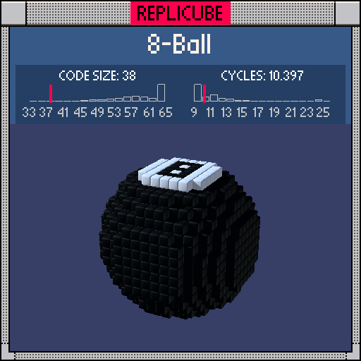

# 8-Ball

> A whole billiard ball with the "8" marking in 38 tokens ᕙ(⇀‸↼‶)ᕗ



| Grid | Code Size | Leaderboard | Cycles | Leaderboard | Date |
|:----:|:---------:|:-----------:|:------:|:-----------:|:----:|
| 15x15x15 | **38** | #14 | **10.397** | #787 | 2026-02-24 |

## Solution

```lua
return x*x+y*y+z*z<64 and(y==7 and max(abs(z),abs(abs(x)-1))~=1 or 3)
```

## How it works

A BLACK sphere with a WHITE "8" on top.

The sphere is just `x*x+y*y+z*z<64` (radius squared). Everything inside defaults to BLACK via `or 3` at the end.

The magic is in how `~=1 or 3` flips colors at y=7. The "8" shape is drawn with Chebyshev distance: `max(abs(z), abs(abs(x)-1))`. That nested `abs(abs(x)-1)` is the key trick. It measures distance to the nearest of x=-1 and x=1 (the two circle centers of the "8"). Combined with `abs(z)` in a `max`, it traces two overlapping square rings. Where that equals 1, the `~=1` fails, falling through to `or 3` for BLACK strokes. Everywhere else on y=7, `~=1` succeeds as bare `true` = WHITE.
