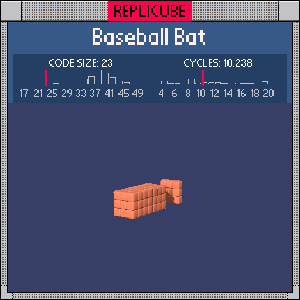

# Baseball Bat

> One line, zero variables, pure bat ᕦ(ò_óˇ)ᕤ



| Grid | Code Size | Leaderboard | Cycles | Leaderboard | Date |
|:----:|:---------:|:-----------:|:------:|:-----------:|:----:|
| 11x11x11 | **23** | #55 | **10.238** | #1261 | 2026-02-23 |

## Solution

```lua
return x*x|y*y<=(z>-5 and z<-1 and 0 or 1)and 8
```

## How it works

A bat is just a stick that's thick at the ends and thin in the middle! The right side of `<=` decides the thickness: in the handle zone (z from -4 to -2) it's 0, everywhere else it's 1. That's a simple `and/or` ternary.

The left side uses our favorite trick: `x*x|y*y` (bitwise OR of squares). When compared against 0, it's true only when both x and y are exactly 0 (the thin handle). When compared against 1, it allows x,y to be -1,0,1 (the thick barrel). One comparison does both coordinate checks at once!

The whole bat is a single `return` with no variables. Just math, one branch, and an orange cube.
