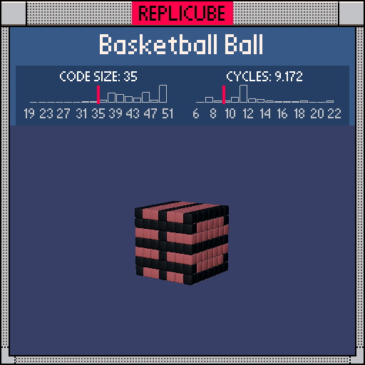

# Basketball Ball

> No variables, no abs, just vibes and squares (⌐■_■)



| Grid | Code Size | Leaderboard | Cycles | Leaderboard | Date |
|:----:|:---------:|:-----------:|:------:|:-----------:|:----:|
| 7x7x7 | **35** | #101 | **9.172** | #242 | 2026-02-23 |

## Solution

```lua
return(x*y==0 or x*x>8 and y*y>4 or y*y==4 and z*z>8)and 3 or 15
```

## How it works

A brown cube with black seam lines, no variables needed!

The main cross seam uses `x*y==0`: when a product of two coordinates is zero, at least one of them IS zero. That single check replaces what would normally be `abs(x)==0 or abs(y)==0` with way fewer tokens.

The side seams are two extra lines: vertical stripes at the x-edges (`x*x>8` means x is at +-3) where y is tall enough, and a horizontal ring at y=+-2 on the z-edges. All squared comparisons, no `abs` calls anywhere.

Everything seam-like gets BLACK(3), and the rest falls through to BROWN(15).
