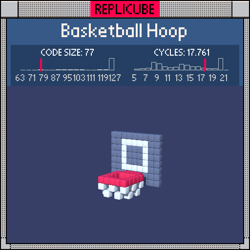

# Basketball Hoop

> Rim, net, backboard, bracket... all in one `return` (⊙_⊙)



| Grid | Code Size | Leaderboard | Cycles | Leaderboard | Date |
|:----:|:---------:|:-----------:|:------:|:-----------:|:----:|
| 9x9x9 | **77** | #59 | **17.761** | #2129 | 2026-02-23 |

## Solution

```lua
n=max(abs(x),abs(z-1))
return y==-2 and(n==2 or x*x<4 and z==-2)and 7 or n==2 and y<-2 and~(x+z+y)&1 or z==-3 and y>-4 and(max(abs(x),abs(y-1))==2 or 2)
```

## How it works

Four parts of a hoop packed into one chain.

The **rim** and **bracket** are both red at y=-2, so we gate on that first. The rim is the square ring (`n==2`, Chebyshev distance from the center of the hoop at z=1), and the bracket connects it to the backboard at z=-2. One `and 7` covers both.

The **net** hangs below the rim (y<-2) along the same ring. A 3D checkerboard pattern `~(x+z+y)&1` creates the mesh look, returning 1 (WHITE) for net threads and 0 (empty) for the gaps. The bitwise NOT trick flips parity without needing `+1` or parentheses around the sum.

The **backboard** sits at z=-3 with a white frame and grey fill. Bare `true` returns WHITE for the frame edge (`max==2`), and everything inside falls through to `or 2` for GREY.
