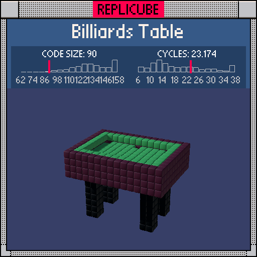

# Billiards Table

> Legs, frame, pockets, and green felt all in one chain ᕙ(⇀‸↼‶)ᕗ



| Grid | Code Size | Leaderboard | Cycles | Leaderboard | Date |
|:----:|:---------:|:-----------:|:------:|:-----------:|:----:|
| 15x15x15 | **90** | #22 | **23.174** | #922 | 2026-02-24 |

## Solution

```lua
a=abs(x)b=abs(z)m=max(a,b-2)
return y<0 and a&-2==2 and b&-2==4 and 3 or y>-1 and m<6 and(y<2 and 16 or y<4 and(y==3 and m==4 and 11 or m>3 and 16 or y==2 and(a~=3 or b%5>0)and 11))
```

## How it works

The key variable is `m=max(abs(x), abs(z)-2)`. The table is longer in z than x, so subtracting 2 from abs(z) makes it a nice centered Chebyshev distance. Everything layers on top of that.

The **legs** (BLACK) sit under the table at four corners. `a&-2==2` is a bit trick that matches abs(x)=2 or 3, and `b&-2==4` matches abs(z)=4 or 5. Two checks, four legs.

The **table body** (DARKBROWN) at y=0,1 is just `y<2 and 16` for anything inside m<6.

At y=2 and y=3, the **rim** (DARKBROWN) wraps around the outer edge where m>3, and the **green felt** fills the inside. The felt surface at y=2 has six pocket holes carved out with `a~=3 or b%5>0`, which removes voxels at the corners and midpoints. At y=3, the GREEN **rail** sits at m==4 with open air above the table inside.
