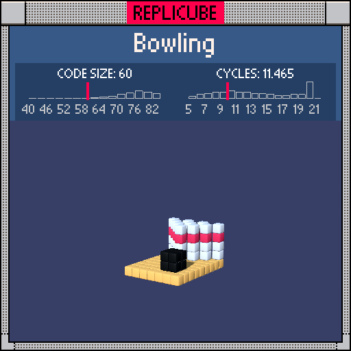

# Bowling

> Lane, pins, AND a bowling ball in one `return` (⊙ᗜ⊙)



| Grid | Code Size | Leaderboard | Cycles | Leaderboard | Date |
|:----:|:---------:|:-----------:|:------:|:-----------:|:----:|
| 9x9x9 | **60** | #19 | **11.465** | #391 | 2026-02-24 |

## Solution

```lua
return y==-4 and abs(x)<4 and 9 or abs(x)+z<0 and(x+z)%2>0 and y<1 and(y~=-1 or 7)or x>0 and x<3 and z>>1==1 and y<-1 and 3
```

## How it works

Three things on the lane, chained together with `and/or`.

The **lane floor** is just the bottom layer (y=-4) painted YELLOW across x=-3 to 3.

The **pins** form a triangle using a neat condition: `abs(x)+z<0`. This draws a diagonal boundary where pins only exist in the "back" of the grid. A `(x+z)%2>0` checkerboard thins them into the classic pin arrangement. Most layers are WHITE, but `y~=-1 or 7` flips the y=-1 stripe to RED for the pin necks.

The **bowling ball** is a tiny 2x2x2 BLACK cube sitting behind the pins. `z>>1==1` is a bit-shift trick that matches z=2 and z=3 in one check.
