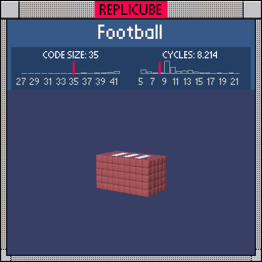

# Football

> Square ball, real laces ╰(°▽°)╯



| Grid | Code Size | Leaderboard | Cycles | Leaderboard | Date |
|:----:|:---------:|:-----------:|:------:|:-----------:|:----:|
| 9x9x9 | **35** | #57 | **8.214** | #339 | 2026-02-23 |

## Solution

```lua
return y*y|z*z<9 and(z*z<2 and y==2 and x%2==0 and x*x<16 or 15)
```

## How it works

The whole football is one `return` statement, no variables needed!

The body shape is a square cross-section tube: `abs(y)<3 and abs(z)<3`. Instead of calling `max` and `abs`, we use the bitwise OR trick: `y*y|z*z<9`. Since bitwise OR of two squares is always at least as big as either one, checking `<9` guarantees both `y*y<9` and `z*z<9` at once. Cheaper AND fewer cycles.

The white laces sit on top (y=2) in a thin strip (z=-1,0,1) at every other x position. Bare `true` returns WHITE for free, no `and 1` needed. Everything that isn't laces falls through to `or 15` for BROWN leather.
