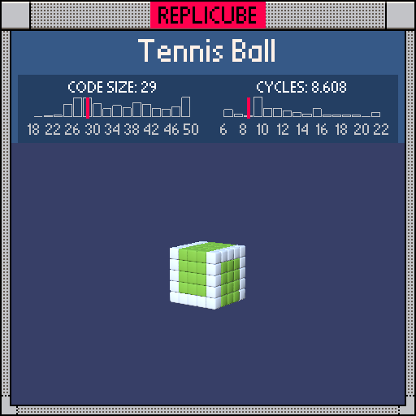

# Tennis Ball

> No `abs`, no temps, no problem ᐠ( ᐛ )ᐟ



| Grid | Code Size | Leaderboard | Cycles | Leaderboard | Date |
|:----:|:---------:|:-----------:|:------:|:-----------:|:----:|
| 5x5x5 | **29** | #533 | **8.608** | #255 | 2026-02-23 |

## Solution

```lua
return x*x==4 and(z*z==4 or y==2)or z*z==4 and y==-2 or 10
```

## How it works

A solid green cube with white seams wrapping around it. The seam has three parts: edges where both x and z are at their max (`x*x==4 and z*z==4`), a horizontal ring around the top (`x*x==4 and y==2`), and another around the bottom (`z*z==4 and y==-2`). Together they form that classic tennis ball curve.

Bare `true` gives us WHITE for free on the seams, and everything else falls through to `or 10` for LIGHTGREEN. The whole ball is just one `return` with no variables at all!
