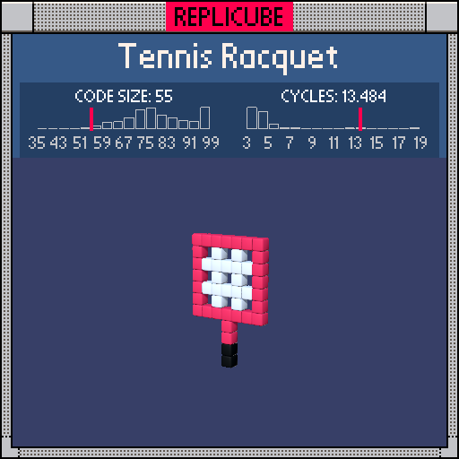

# Tennis Racquet

> 55 tokens for a racquet with strings, frame, AND a two-tone handle ᕙ(⌐■_■)ᕗ



| Grid | Code Size | Leaderboard | Cycles | Leaderboard | Date |
|:----:|:---------:|:-----------:|:------:|:-----------:|:----:|
| 11x11x11 | **55** | #33 | **13.484** | #1516 | 2026-02-23 |

## Solution

```lua
a=max(abs(x),abs(y-2))
return z==0 and(a==3 and 7 or a<3 and max(x%2,y%2)or x==0 and y<-1 and(y>-4 and 7 or 3))
```

## How it works

Everything lives on the z=0 plane. One variable `a` does most of the work: it's the Chebyshev distance (square distance) from the center of the head at (0,2).

The **frame** is the red ring at a=3. The **strings** are the grid pattern inside (a<3) where `max(x%2,y%2)` returns 1 (WHITE) when either coordinate is odd, and 0 (empty) for the gaps where both are even. That `max` trick gives us a mesh pattern with holes for free!

The **handle** hangs below (x=0, y<-1): red grip at the top (y=-2,-3), black butt cap at the bottom (y=-4,-5). The reference used tables and `btoi` calls for all this, but chained `and/or` gets it done in about half the tokens.
