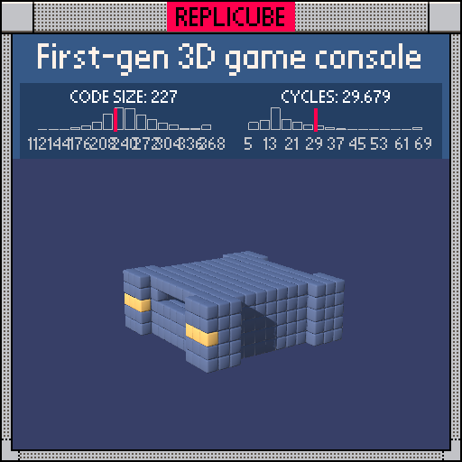

# First-gen 3D game console

> RIP 3DO. Gone too soon, but never forgotten (´;ω;`)



| Grid | Code Size | Leaderboard | Cycles | Leaderboard | Date |
|:----:|:---------:|:-----------:|:------:|:-----------:|:----:|
| 13x13x13 | **227** | #294 | **29.679** | #815 | 2026-02-24 |

## Solution

```lua
a=abs(x)
b=abs(y)
c=abs(z)
if z==-5 and y==-1 then if x>0 and a<3 then return 3 end if x>-4 and x<0 then return 7-2*x*(x+2)end end
if y==0 and z>-4 and z<-1 then if x>-4 and x<-1 then return 3 end if x>=0 and x<4 then return 7+(x+z)%2 end end
if y==0 and z<6 and(x*x+(z-2)^2<6 or z>1 and a<3)then return 2 end
if a<5 and c<5 and b<2 then return y==-1 and 11 or 0 end
if a<6 and c<6 and b<3 then return a<3 and z>0 and y==1 and 0 or 2 end
if b<3 and(a-5)^2+(c-5)^2<4 then return z>5 and y==0 and a<7 and 9 or 2 end
```

## How it works

This is a detailed 3DO console model with a bunch of distinct features layered on top of each other. The trick is checking the most specific stuff first so it doesn't get overwritten.

**Output ports** on the back wall (z=-5, y=-1) come first. The three colored AV jacks use a quadratic formula `7-2*x*(x+2)` that maps x=-3,-2,-1 to WHITE, RED, YELLOW. The two BLACK ports sit next to them.

**CPU and chips** live on the internal floor (y=0). A BLACK processor and a RED/ORANGE checkerboard chip pattern using `(x+z)%2`.

The **CD tray** is a disc shape centered at z=2 on the y=0 plane. Instead of `min(sqrt(...), ternary) < 2.5`, we squared the threshold: `x*x+(z-2)^2 < 6` handles the round part, and `z>1 and a<3` handles the rectangular slot. Way cheaper!

The **hollow interior** (GREEN floor at y=-1, empty above) and **GREY shell** with its front slot come next. Finally, the **rounded corners** use squared distance `(a-5)^2+(c-5)^2 < 4` instead of `sqrt(...) < 2`, with a YELLOW racing stripe on the front edge.
