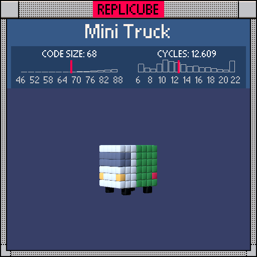

# Mini Truck

> Why DID the rabbit need to cross so many busy roads? (⊙_⊙)



| Grid | Code Size | Leaderboard | Cycles | Leaderboard | Date |
|:----:|:---------:|:-----------:|:------:|:-----------:|:----:|
| 7x7x7 | **68** | #44 | **10.656** | #739 | 2026-02-24 |

## Solution

```lua
return x*x==4 and(y==-3 and z*z==4 and 3 or y==-1 and z*z==9 and z/3+8)or x*x<9 and y>-3 and(y>0 and y<3 and z>1 and 2 or z<1 and 11 or 1)
```

## How it works

The truck splits naturally into two branches: the x=±2 edges (wheels and lights) and the body.

`x*x==4` catches the **wheels** and **lights** first. Wheels are BLACK at the four corners (y=-3, z=±2). Lights sit at the bumper edges (y=-1, z=±3), and `z/3+8` picks RED(7) for the front headlights and YELLOW(9) for the rear. Division by 3 turns z=±3 into ±1, then +8 shifts into color range. Neat little trick!

The **body** (`x*x<9`, everything inside x=±2) is a GREEN front half (`z<1`) and WHITE back half, with GREY cab windows overriding at y=1,2 for z>1. The `or 1` at the end catches everything that isn't green or windshield as WHITE.
