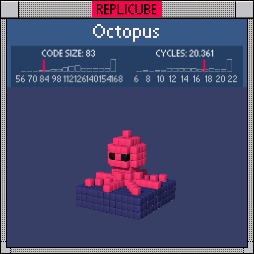

# Octopus

> Sphere head, 8-way star tentacles, and underwater lighting (°◡°)



| Grid | Code Size | Leaderboard | Cycles | Leaderboard | Date |
|:----:|:---------:|:-----------:|:------:|:-----------:|:----:|
| 11x11x11 | **83** | #34 | **20.361** | #823 | 2026-02-24 |

## Solution

```lua
d=x*x+z*z h=y-2
return y<-2 and 12 or d+h*h<8 and(h==0 and z==2 and x%2>0 and 3 or 7)or(x*x-z*z)*x*z==0 and d<33 and(y+2)*(y+2)*d<5 and 7
```

## How it works

Three layers: water, head, tentacles.

Everything below y=-2 is DARKBLUE **water**. The **head** is a RED sphere centered at y=2, checked with `d+h*h<8` (squared radius ~2.8). Two BLACK **eyes** peek out at z=2 where `x%2>0` catches x=±1.

The **tentacles** are the fun part. `(x*x-z*z)*x*z==0` is a single product that's zero exactly along 8 directions: the 4 axes (where x or z is 0) and 4 diagonals (where abs(x)==abs(z)). That gives the star pattern for free! The reach is capped by `d<33`, and `(y+2)*(y+2)*d<5` makes them taller near the center and shorter at the tips, so they curve upward naturally toward the head.
