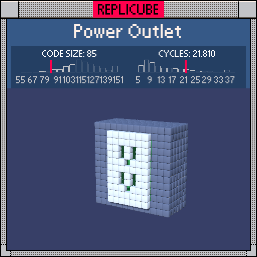

# Power Outlet

> A robot whose head IS the power source? That's just a phone with legs (￣ω￣)



| Grid | Code Size | Leaderboard | Cycles | Leaderboard | Date |
|:----:|:---------:|:-----------:|:------:|:-----------:|:----:|
| 13x13x13 | **85** | #54 | **21.810** | #1027 | 2026-02-24 |

## Solution

```lua
a=3-abs(x)
b=4-abs(y)
return z==0 and a>=0 and b>-2 and(a>1 and(y+a)%4<4-a and b>-1 and 0 or 1)or z<0 and(min(a,z+4,b)==0 and 11 or a>0 and b>0 and z>-4 and 0 or 2)
```

## How it works

Two variables do all the heavy lifting: `a` is how far inward you are from the x-edges (0 at x=±3), and `b` is the same for y-edges (0 at y=±4). These turn "am I on the border?" into simple `==0` checks.

The **face plate** (z=0) is a WHITE rectangle. The socket holes get punched out by a sneaky unified formula: `(y+a)%4 < 4-a`. When `a` is 2 (x=±1), this becomes `(y+2)%4 < 2`, carving the two vertical slots. When `a` is 3 (x=0), it becomes `(y+3)%4 < 1`, poking the ground pin. One expression, both socket types!

Behind the face, `min(a, z+4, b)==0` catches the GREEN box shell. The `min` trick is elegant: it equals zero exactly when you're on a face of the box (one coordinate hits the boundary) and all coordinates are non-negative (you're inside the box bounds). Everything inside the shell is empty, and the GREY fill covers whatever's left behind.
